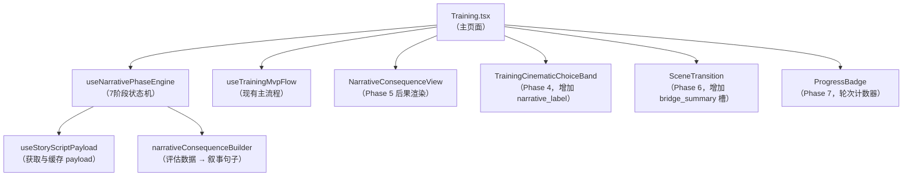
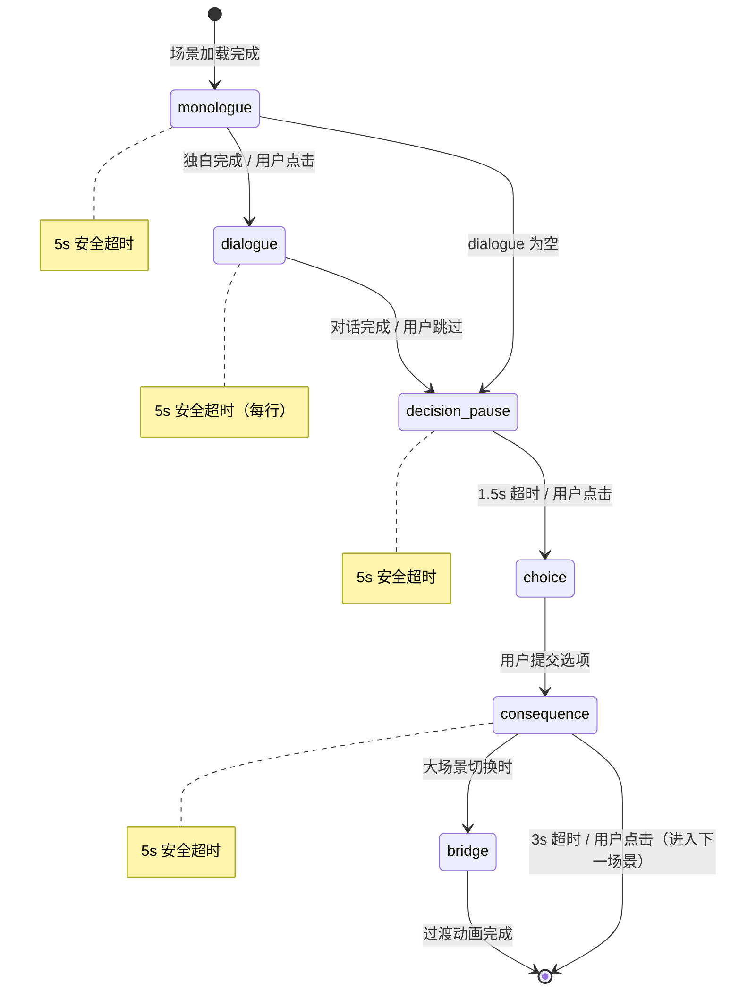
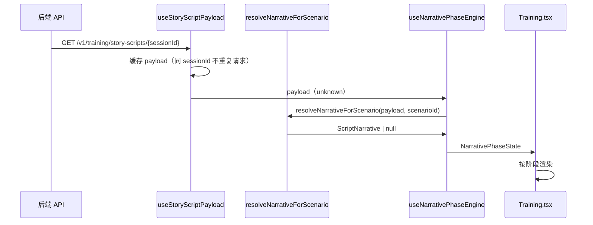

# 设计文档：训练交互增强（training-interaction-enhancement）

## 概述

本功能将训练页面从"训练工具界面"重构为"嵌入式评估的互动叙事体验"。核心设计原则是：**系统信息必须伪装为故事的一部分，用户应主动想要放慢节奏，而非被迫等待。**

交互流程分为七个叙事阶段，依次为：

```
独白（Phase 1）→ 对话（Phase 2）→ 决策停顿（Phase 3）→ 选项（Phase 4）
→ 后果叙事（Phase 5）→ 过渡桥接（Phase 6）→ 进度（Phase 7）
```

所有系统数据（`skill_delta`、`risk_flags`、`impact_hint`）必须渲染为叙事文本，禁止以原始值展示。每个等待状态均可被用户点击跳过，并设有 5 秒安全超时。

---

## 架构

### 组件与 Hook 架构图



### 7 阶段状态机



**降级路径：** 当 `ScriptNarrative` 不可用时，状态机直接跳过 Phase 1–3，使用现有 `brief + mission` 叙事文本，从 Phase 4（选项）开始。

---

## 组件与接口

### 1. 新 Hook：`useNarrativePhaseEngine`

**路径：** `frontend/src/hooks/useNarrativePhaseEngine.ts`

管理 7 阶段叙事状态机，是本功能的核心协调器。

```typescript
export type NarrativePhase =
  | 'monologue'
  | 'dialogue'
  | 'decision_pause'
  | 'choice'
  | 'consequence'
  | 'bridge'
  | 'progress';

export interface NarrativePhaseState {
  phase: NarrativePhase;
  // Phase 1
  monologueSegments: string[];
  currentSegmentIndex: number;
  // Phase 2
  dialogueLines: ScriptNarrativeLine[];
  currentDialogueIndex: number;
  // Phase 3
  decisionPrompt: string;
  // Phase 5
  consequenceLines: string[];
  // Phase 6
  bridgeSummary: string;
}

export interface UseNarrativePhaseEngineOptions {
  scenario: TrainingScenario | null;
  storyScriptPayload: unknown;
  latestOutcome: TrainingRoundOutcomeView | null;
  onPhaseComplete: (phase: NarrativePhase) => void;
}

export function useNarrativePhaseEngine(
  options: UseNarrativePhaseEngineOptions
): {
  state: NarrativePhaseState;
  advance: () => void;       // 用户点击推进
  skipToChoice: () => void;  // 跳过到选项阶段
}
```

**关键行为：**
- 场景 ID 变化时重置状态机到 `monologue`（或降级到 `choice`）
- 每个阶段设置 5 秒安全超时（`window.setTimeout`），超时后自动调用 `advance()`
- `decision_pause` 阶段固定 1.5 秒后自动推进
- `consequence` 阶段固定 3 秒后自动推进

### 2. 新 Hook：`useStoryScriptPayload`

**路径：** `frontend/src/hooks/useStoryScriptPayload.ts`

负责获取、缓存 `StoryScriptPayload`，不阻塞主流程。

```typescript
export type StoryScriptLoadStatus = 'idle' | 'loading' | 'ready' | 'unavailable';

export interface UseStoryScriptPayloadResult {
  payload: unknown;           // 原始 payload，供 resolveNarrativeForScenario 使用
  status: StoryScriptLoadStatus;
}

export function useStoryScriptPayload(
  sessionId: string | null | undefined
): UseStoryScriptPayloadResult
```

**关键行为：**
- `sessionId` 就绪后异步发起 `GET /v1/training/story-scripts/{sessionId}`
- 同一 `sessionId` 只请求一次，结果缓存在 `useRef` 中
- 状态为 `pending` 或 `running` 时，3 秒后重试，最多重试 2 次
- 请求失败时 `status` 设为 `unavailable`，`payload` 为 `null`

### 3. 新组件：`NarrativeConsequenceView`

**路径：** `frontend/src/components/training/NarrativeConsequenceView.tsx`

渲染 Phase 5 后果叙事，将评估数据转化为叙事句子展示。

```typescript
interface NarrativeConsequenceViewProps {
  lines: string[];           // 由 narrativeConsequenceBuilder 生成的叙事句子
  onClick: () => void;       // 用户点击跳过
}
```

**渲染结构：**
```
[叙事句子列表，逐行淡入]
[底部提示：点击继续]
```

### 4. 修改组件：`TrainingCinematicChoiceBand`

**路径：** `frontend/src/components/training/TrainingCinematicChoiceBand.tsx`

新增 `narrativeLabels` prop，为每个选项展示叙事副标签。

```typescript
interface TrainingCinematicChoiceBandProps {
  options: TrainingScenarioOption[];
  selectedOptionId: string | null;
  onSelectOption: (optionId: string) => void;
  disabled?: boolean;
  ariaLabel?: string;
  // 新增
  narrativeLabels?: Record<string, string>; // optionId → narrative_label
}
```

**渲染变化：** 每个选项按钮内新增 `<span class="training-cinematic-choice-band__option-narrative">` 元素，当 `narrativeLabels[option.id]` 存在时显示，否则不渲染该元素。

### 5. 修改组件：`SceneTransition`

**路径：** `frontend/src/components/SceneTransition.tsx`

新增 `bridgeSummary` prop，在过渡动画中展示氛围文字。

```typescript
interface SceneTransitionProps {
  sceneName: string;
  actNumber: number;
  onComplete: () => void;
  tone?: SceneTransitionTone;
  // 新增
  bridgeSummary?: string | null;
}
```

**渲染变化：** 当 `bridgeSummary` 非空时，在场景名称下方渲染 `<p class="scene-transition-bridge">` 元素，使用斜体氛围字体样式。

### 6. 修改页面：`Training.tsx`

**路径：** `frontend/src/pages/Training.tsx`

集成 `useNarrativePhaseEngine` 和 `useStoryScriptPayload`，替换现有 `narrationText` 逻辑。

**主要变化：**
- 引入 `useStoryScriptPayload(sessionView?.sessionId)` 获取 payload
- 引入 `useNarrativePhaseEngine` 管理阶段状态
- 将 `choiceStage` 状态机替换为 `phaseEngine.state.phase`
- 在 `SceneTransition` 调用处传入 `bridgeSummary`
- 新增 `ProgressBadge` 组件展示轮次信息
- 新增 `NarrativeConsequenceView` 组件展示 Phase 5

### 7. 新工具函数：`narrativeConsequenceBuilder`

**路径：** `frontend/src/utils/narrativeConsequenceBuilder.ts`

将评估数据转化为叙事句子数组。

```typescript
export interface NarrativeConsequenceInput {
  impactHint: string | null;
  riskFlags: string[];
  skillDelta: Record<string, number>;
}

export function buildNarrativeConsequence(
  input: NarrativeConsequenceInput
): string[]
```

**转换规则：**
- `impactHint` 非空 → 包装为叙事句子，例如 `"消息扩散"` → `"你按下了发送键。几分钟后，消息迅速扩散。"`
- `riskFlags` 每条 → 转化为后果描述，例如 `"panic"` → `"⚠ 一些未经核实的信息引发了公众恐慌。"`
- `skillDelta` 中 `|delta| > 0.05` 的项 → 转化为隐性提示，例如 `"verify_skill: +0.12"` → `"编辑对你的信任有所提升。"`
- 三者均为空/零时返回空数组 `[]`

---

## 数据模型

### 数据流：API → StoryScriptPayload → ScriptNarrative → 各阶段



### 关键类型扩展

现有 `ScriptNarrative`（已定义于 `frontend/src/types/training.ts`）：

```typescript
export interface ScriptNarrative {
  monologue: string;
  dialogue: ScriptNarrativeLine[];
  bridge_summary: string;
  options_narrative: Record<string, ScriptNarrativeOptionItem>;
}
```

新增 `NarrativePhaseState`（定义于 `useNarrativePhaseEngine.ts`）：

```typescript
export interface NarrativePhaseState {
  phase: NarrativePhase;
  monologueSegments: string[];      // monologue 按句号/换行分段
  currentSegmentIndex: number;      // 当前展示到第几段
  dialogueLines: ScriptNarrativeLine[]; // 最多 6 行
  currentDialogueIndex: number;     // 当前展示到第几行
  decisionPrompt: string;           // 决策停顿提示语
  consequenceLines: string[];       // narrativeConsequenceBuilder 输出
  bridgeSummary: string;            // bridge_summary 原文
}
```

### 独白分段逻辑

`monologue` 文本按以下规则分段：
1. 按 `\n\n` 分割为段落
2. 每段内按 `。！？…` 分割为句子
3. 每段作为一个打字机单元，段间有视觉停顿（300ms）

### 决策停顿提示语池

```typescript
const DECISION_PROMPTS = [
  '你需要做出决定了。',
  '现在，你会怎么做？',
  '时间不多了，选择吧。',
];
// 每次场景加载时随机选取一条
```

### 风险标记叙事映射

```typescript
const RISK_FLAG_NARRATIVES: Record<string, string> = {
  panic: '⚠ 一些未经核实的信息引发了公众恐慌。',
  source_exposed: '⚠ 消息来源已经暴露，后续报道将面临压力。',
  editor_locked: '⚠ 编辑部对你的判断产生了质疑。',
  high_risk_path: '⚠ 你选择了一条充满风险的道路。',
  // 未知标记使用通用模板
};
const RISK_FLAG_FALLBACK = (flag: string) => `⚠ 检测到风险：${flag}。`;
```

### 技能变化叙事映射

```typescript
const SKILL_DELTA_NARRATIVES: Record<string, { positive: string; negative: string }> = {
  verify_skill: {
    positive: '编辑对你的信任有所提升。',
    negative: '你的核实能力受到了质疑。',
  },
  // 未知技能使用通用模板
};
const SKILL_DELTA_THRESHOLD = 0.05; // |delta| > 0.05 才展示
```

---

## 正确性属性

*属性（Property）是在系统所有有效执行中都应成立的特征或行为——本质上是关于系统应该做什么的形式化陈述。属性是人类可读规范与机器可验证正确性保证之间的桥梁。*

### 属性 1：独白打字机逐字显示

*对于任意* 非空 `monologue` 文本，打字机效果应逐字符显示文本，且在完成前任意时刻 `displayedText.length < fullText.length`，完成后 `displayedText === fullText`。

**验证：需求 1.1**

### 属性 2：ScriptNarrative 不可用时降级到 brief+mission

*对于任意* 场景（包含非空 `brief` 和 `mission`），当 `ScriptNarrative` 为 `null` 或 `undefined` 时，叙事文本应等于 `brief + "\n\n任务：" + mission` 的拼接结果。

**验证：需求 1.2、9.3**

### 属性 3：独白分段展示

*对于任意* 包含多个句子的 `monologue` 文本，`splitMonologueIntoSegments` 函数应返回长度大于 1 的数组，且所有段落拼接后等于原始文本（去除分隔符后）。

**验证：需求 1.3**

### 属性 4：点击跳过打字机

*对于任意* 打字机进行中的状态，调用 `skip()` 后 `displayedText` 应立即等于完整文本，`isDone` 应为 `true`。

**验证：需求 1.4、8.1**

### 属性 5：对话行截断

*对于任意* 长度超过 6 的 `dialogue` 数组，`useNarrativePhaseEngine` 应只保留前 6 行，`dialogueLines.length <= 6` 恒成立。

**验证：需求 2.3**

### 属性 6：对话逐行揭示

*对于任意* 非空 `dialogue` 列表，在 `dialogue` 阶段任意时刻，`currentDialogueIndex` 应满足 `0 <= currentDialogueIndex < dialogueLines.length`，且每次 `advance()` 调用后索引递增 1（直到最后一行）。

**验证：需求 2.2、8.2**

### 属性 7：选项叙事标签渲染

*对于任意* 选项列表和 `options_narrative` 映射，当 `options_narrative[option.id]` 存在时，`TrainingCinematicChoiceBand` 渲染结果应包含 `narrative_label` 文本；当不存在时，不应渲染副文本 DOM 元素。

**验证：需求 4.1、4.2、4.3**

### 属性 8：skillDelta 阈值规则

*对于任意* `skillDelta` 映射，`buildNarrativeConsequence` 应仅对 `|delta| > 0.05` 的项生成叙事句子；对所有 `|delta| <= 0.05` 的项不生成任何叙事句子。

**验证：需求 5.4、5.5**

### 属性 9：系统数据不以原始格式展示

*对于任意* 评估数据（包含 `skillDelta`、`riskFlags`、`impactHint`），`buildNarrativeConsequence` 的输出字符串数组中不应包含以下模式：数字加减号（如 `+0.05`）、`skill_delta`、`risk_flags`、原始 flag 标识符（如 `source_exposed`）。

**验证：需求 5.6、7.3、8.3**

### 属性 10：后果叙事空值跳过

*对于任意* `impactHint` 为空、`riskFlags` 为空数组、`skillDelta` 中所有值绝对值均不超过 0.05 的输入，`buildNarrativeConsequence` 应返回空数组 `[]`。

**验证：需求 5.7**

### 属性 11：bridge_summary 渲染与降级

*对于任意* `SceneTransition` 调用，当 `bridgeSummary` 为非空字符串时，渲染结果应包含该文本；当 `bridgeSummary` 为空或 `null` 时，不应渲染额外文字区域。

**验证：需求 6.1、6.3**

### 属性 12：进度格式正确性

*对于任意* `roundNo`（正整数）和 `totalRounds`（正整数或 null），进度元素的文本内容应满足：`totalRounds` 存在时为 `"第 N 轮 / 共 M 轮"`，不存在时为 `"第 N 轮"`。

**验证：需求 7.1、7.2**

### 属性 13：5 秒安全超时

*对于任意* 阶段（monologue、dialogue、decision_pause、consequence），`useNarrativePhaseEngine` 应在该阶段持续超过 5000ms 后自动调用 `advance()` 推进到下一阶段。

**验证：需求 8.4**

### 属性 14：StoryScriptPayload 缓存不重复请求

*对于任意* 固定 `sessionId`，`useStoryScriptPayload` 在整个 hook 生命周期内应最多发起 1 次（加上最多 2 次重试）网络请求，场景切换不触发新请求。

**验证：需求 9.4**

### 属性 15：ScriptNarrative 字段级降级

*对于任意* 缺少单个字段（如 `monologue` 为 `undefined`）的 `ScriptNarrative` 对象，`resolveNarrativeForScenario` 应返回非 null 结果，且其他字段正常可用，不抛出运行时错误。

**验证：需求 9.6、1.6**

---

## 错误处理

### 降级策略

| 场景 | 降级行为 |
|------|----------|
| `StoryScriptPayload` 获取失败 | `status = 'unavailable'`，跳过 Phase 1–3，使用 `brief + mission` |
| `ScriptNarrative` 字段缺失 | 对缺失字段单独降级（空字符串/空数组），不影响其他字段 |
| `monologue` 为空 | 跳过 Phase 1，直接进入 Phase 2 |
| `dialogue` 为空 | 跳过 Phase 2，直接进入 Phase 3 |
| `bridge_summary` 为空 | `SceneTransition` 不渲染额外文字区域 |
| `options_narrative` 缺失 | `ChoiceBand` 仅展示原始 `label`，功能完整 |
| 后果数据全为空/零 | 跳过 Phase 5，直接进入下一场景 |

### 安全超时

所有等待状态均设置 5 秒安全超时，防止页面卡死：

```typescript
// useNarrativePhaseEngine 内部
const SAFETY_TIMEOUT_MS = 5000;
const DECISION_PAUSE_MS = 1500;
const CONSEQUENCE_AUTO_ADVANCE_MS = 3000;

useEffect(() => {
  const timer = window.setTimeout(() => advance(), SAFETY_TIMEOUT_MS);
  return () => window.clearTimeout(timer);
}, [phase]);
```

### 错误边界

`NarrativeConsequenceView` 和 `useNarrativePhaseEngine` 内部的所有 `resolveNarrativeForScenario` 调用均包裹在 try-catch 中，异常时静默降级，不向用户展示错误提示。

---

## 测试策略

### 双轨测试方法

本功能采用单元测试与属性测试相结合的方式：

- **单元测试**：验证具体示例、边界条件和错误处理
- **属性测试**：验证跨所有输入的通用属性

两者互补，共同提供全面覆盖。

### 单元测试重点

- `narrativeConsequenceBuilder`：具体 flag 映射、技能名称映射、空值处理
- `useNarrativePhaseEngine`：阶段转换序列、超时行为、降级路径
- `useStoryScriptPayload`：重试逻辑、缓存行为
- `TrainingCinematicChoiceBand`：有/无 `narrativeLabels` 时的渲染
- `SceneTransition`：有/无 `bridgeSummary` 时的渲染

### 属性测试配置

使用 **fast-check**（TypeScript 属性测试库）。每个属性测试运行最少 100 次迭代。

每个属性测试必须包含注释标签：
```typescript
// Feature: training-interaction-enhancement, Property N: <属性描述>
```

**属性测试文件：**
- `frontend/src/utils/narrativeConsequenceBuilder.test.ts`（属性 8、9、10）
- `frontend/src/hooks/useNarrativePhaseEngine.test.ts`（属性 5、6、13）
- `frontend/src/hooks/useStoryScriptPayload.test.ts`（属性 14）
- `frontend/src/components/training/TrainingCinematicChoiceBand.test.tsx`（属性 7）
- `frontend/src/components/SceneTransition.test.tsx`（属性 11）
- `frontend/src/utils/trainingSession.test.ts`（属性 15，扩展现有测试）

**示例属性测试（属性 8）：**

```typescript
import fc from 'fast-check';
import { buildNarrativeConsequence } from './narrativeConsequenceBuilder';

// Feature: training-interaction-enhancement, Property 8: skillDelta 阈值规则
test('|delta| > 0.05 的项生成叙事句子，|delta| <= 0.05 的项不生成', () => {
  fc.assert(
    fc.property(
      fc.dictionary(fc.string(), fc.float({ min: -1, max: 1 })),
      (skillDelta) => {
        const lines = buildNarrativeConsequence({
          impactHint: null,
          riskFlags: [],
          skillDelta,
        });
        const significantKeys = Object.keys(skillDelta).filter(
          (k) => Math.abs(skillDelta[k]) > 0.05
        );
        // 有显著变化时应有输出，无显著变化时应无输出
        if (significantKeys.length === 0) {
          expect(lines).toHaveLength(0);
        } else {
          expect(lines.length).toBeGreaterThan(0);
        }
      }
    ),
    { numRuns: 100 }
  );
});
```

### CSS 方法

遵循现有 `training.css` 模式，最小化新增类名：

**新增 CSS 类（扩展 `Training.css`）：**
```css
/* Phase 1–3 叙事区域 */
.training-narrative-phase { ... }
.training-narrative-phase__segment { ... }
.training-narrative-phase__dialogue-line { ... }
.training-narrative-phase__decision-prompt { ... }

/* Phase 5 后果叙事 */
.training-consequence-view { ... }
.training-consequence-view__line { ... }

/* Phase 7 进度徽章 */
.training-progress-badge { ... }
```

**新增 CSS 类（扩展 `TrainingCinematicChoiceBand.css`）：**
```css
.training-cinematic-choice-band__option-narrative { ... }
```

**新增 CSS 类（扩展 `SceneTransition.css`）：**
```css
.scene-transition-bridge { ... }
```

所有新增样式遵循现有的暖色调（`#2f2014`、`rgba(255,255,255,0.9)`）和圆角（`border-radius: 16px`）设计语言。
