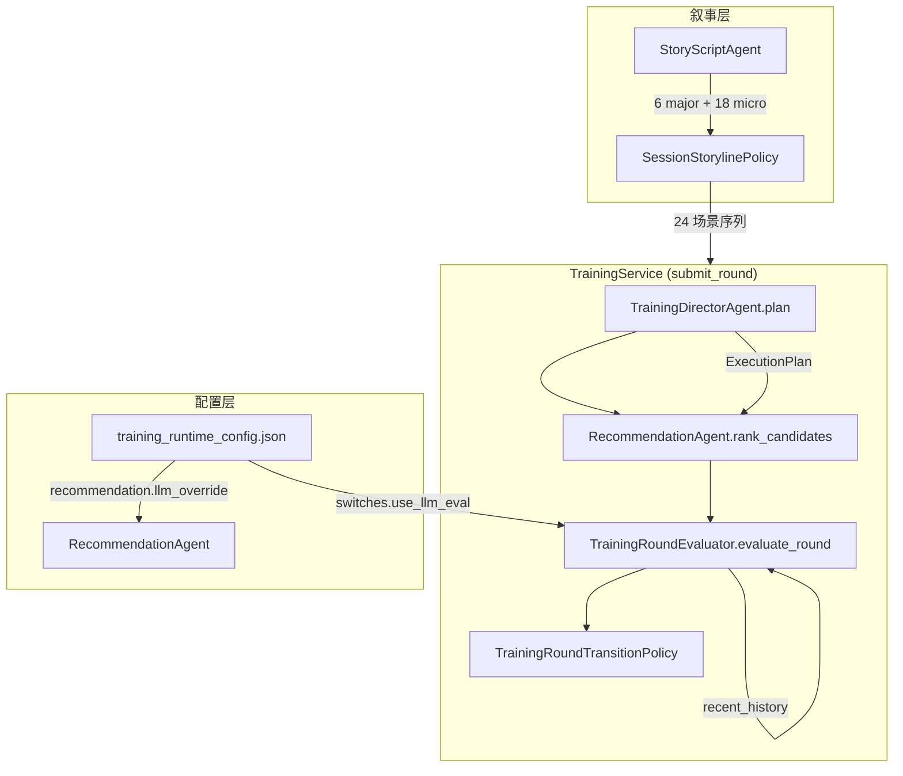

# Design Document: Training Multi-Agent Upgrade

## Overview

本设计文档描述新闻职业技能训练系统（`backend/training/`）Phase 1 多 Agent 升级的技术方案。
升级分四个独立步骤，每步均可独立合并、独立回滚，不破坏现有 API 契约。

**升级目标：**
- Step 1：修复叙事层（StoryScriptAgent）与训练层（SessionStorylinePolicy）的场景结构不一致
- Step 2：将 RecommendationAgent 重写为继承 RecommendationPolicy 的可注入子类
- Step 3：新增 TrainingDirectorAgent，在每轮提交前生成执行计划
- Step 4：为 Evaluator 注入历史上下文，提升 LLM 评估的上下文感知能力


## Architecture

### 整体架构图



### 依赖关系变化

| 组件 | 变化前 | 变化后 |
|------|--------|--------|
| `SessionStorylinePolicy` | `micro_scene_min=2, micro_scene_max=3` | `micro_scene_min=3, micro_scene_max=3` |
| `StoryScriptAgentConfig` | `micro_scenes_per_gap=2`，间隙公式 | `micro_scenes_per_gap=3`，延伸公式 |
| `TrainingService.recommendation_policy` | `RecommendationPolicy` 实例 | `RecommendationAgent` 实例 |
| `TrainingService.submit_round` | 直接进入流程校验 | 先调用 `DirectorAgent.plan()` |
| `TrainingRoundEvaluator.evaluate_round` | 无历史参数 | 新增 `recent_history` 可选参数 |
| `TrainingRoundTransitionPolicy` | 无历史透传 | 透传 `recent_history` 给 evaluator |


## Components and Interfaces

### Step 1：场景结构一致性

#### SessionStorylinePolicy（修改）

```python
# backend/training/session_storyline_policy.py
class SessionStorylinePolicy:
    def __init__(
        self,
        *,
        scenario_repository: ScenarioRepository | None = None,
        micro_scene_min: int = 3,   # 修改：2 -> 3
        micro_scene_max: int = 3,   # 修改：3 保持，但语义从"随机范围"变为"固定值"
    ): ...
```

**变更说明：**
- `micro_scene_min` 默认值从 `2` 改为 `3`
- `micro_scene_max` 保持 `3`，两者相等使每个大场景后固定生成 3 个小场景
- `build_session_sequence` 内部逻辑不变，`rng.randint(3, 3)` 始终返回 3

#### StoryScriptAgentConfig（修改）

```python
# backend/training/story_script_agent.py
@dataclass(frozen=True)
class StoryScriptAgentConfig:
    major_scene_count: int = 6
    micro_scenes_per_gap: int = 3          # 修改：2 -> 3
    temperature: float = 0.65
    max_tokens: int = 2600
```

**total_micro 计算公式修改（在 `_call_llm_generate_payload` 中）：**

```python
# 修改前（间隙模式）：
total_micro = max(0, (required_major - 1) * self.config.micro_scenes_per_gap)

# 修改后（延伸模式）：
total_micro = required_major * self.config.micro_scenes_per_gap
```

**prompt 语义修改：**

```python
# 修改前：
f"- 每两个相邻大场景之间插入 {self.config.micro_scenes_per_gap} 个小场景（scene_type=micro，scene_id=micro-<majorIndex>-<k>）"

# 修改后：
f"- 每个大场景之后紧跟 {self.config.micro_scenes_per_gap} 个小场景（scene_type=micro，scene_id=micro-<majorIndex>-<k>）"
f"- 小场景是大场景情境的延伸（extension），不是大场景之间的过渡（transition）"
```

同步修改 `_build_local_fallback_payload` 中的 micro 生成逻辑：将 `if major_index < required_major:` 改为无条件生成（每个大场景后都生成 micro）。


### Step 2：RecommendationAgent 重写

#### RecommendationAgent（重写）

```python
# backend/training/recommendation_agent.py
class RecommendationAgent(RecommendationPolicy):
    """继承 RecommendationPolicy，在规则排序基础上可选接入 LLM 覆盖 top-1。"""

    def __init__(
        self,
        *,
        llm_service: Any = None,
        use_llm: bool = True,
        runtime_config: Any = None,
        phase_policy: TrainingPhasePolicy | None = None,
    ):
        super().__init__(runtime_config=runtime_config, phase_policy=phase_policy)
        self.use_llm = use_llm
        self._llm_service = llm_service
        # 懒加载 LLM，失败时静默降级
        if use_llm and llm_service is None:
            self._try_init_llm()

    def rank_candidates(
        self,
        training_mode: str,
        scenario_payload_sequence: Sequence[Dict[str, Any]],
        completed_scenario_ids: Sequence[str],
        k_state: Dict[str, float] | None = None,
        s_state: Dict[str, float] | None = None,
        recent_risk_rounds: Sequence[Sequence[str]] | None = None,
        current_round_no: int = 0,
        total_rounds: int | None = None,
    ) -> List[Dict[str, Any]]:
        # 1. 规则排序始终先跑
        ranked = super().rank_candidates(
            training_mode=training_mode,
            scenario_payload_sequence=scenario_payload_sequence,
            completed_scenario_ids=completed_scenario_ids,
            k_state=k_state,
            s_state=s_state,
            recent_risk_rounds=recent_risk_rounds,
            current_round_no=current_round_no,
            total_rounds=total_rounds,
        )
        if not ranked:
            return ranked

        # 2. 为所有候选标记 override_source=rules（默认）
        for item in ranked:
            item.setdefault("recommendation", {})["override_source"] = "rules"

        # 3. 判断是否触发 LLM 覆盖
        if not self.use_llm or self._llm_service is None:
            return ranked
        if not self._should_llm_override(k_state=k_state or {}, s_state=s_state or {},
                                          recent_risk_rounds=list(recent_risk_rounds or [])):
            return ranked

        # 4. LLM 覆盖 top-1，失败时静默降级
        try:
            override = self._llm_select_top1(ranked, k_state or {}, s_state or {})
            if override is not None:
                override["recommendation"]["override_source"] = "llm"
                return [override] + ranked[1:]
        except Exception as exc:
            logger.warning("RecommendationAgent LLM override failed, using rules: %s", exc)

        return ranked

    def _should_llm_override(
        self,
        k_state: Dict[str, float],
        s_state: Dict[str, float],
        recent_risk_rounds: List[Sequence[str]],
    ) -> bool:
        """从 runtime_config.recommendation.llm_override 读取触发条件。"""
        cfg = getattr(self.recommendation_config, "llm_override", None)
        if cfg is None:
            return False
        # 连续高风险轮次
        window = recent_risk_rounds[-int(getattr(cfg, "min_consecutive_risk_rounds", 2)):]
        if len(window) >= int(getattr(cfg, "min_consecutive_risk_rounds", 2)) and all(r for r in window):
            return True
        # 技能极低
        threshold = float(getattr(cfg, "min_weak_skill_threshold", 0.3))
        if any(v < threshold for v in k_state.values()):
            return True
        # 公众恐慌过高
        max_panic = float(getattr(cfg, "max_public_panic", 0.7))
        if s_state.get("public_panic", 0.0) > max_panic:
            return True
        # 编辑信任极低
        min_trust = float(getattr(cfg, "min_editor_trust", 0.25))
        if s_state.get("editor_trust", 0.0) < min_trust:
            return True
        return False
```

**关键设计决策：**
- 继承而非组合：使 `RecommendationAgent` 可直接替换所有 `recommendation_policy: RecommendationPolicy` 注入点，无需修改 `TrainingRoundFlowPolicy`
- `rank_candidates` 重写而非新增方法：保持调用方零感知
- `override_source` 字段在规则路径也写入（值为 `"rules"`），保证审计链路完整


#### TrainingService.__init__ 注入点替换

```python
# backend/api/services/training_service.py
# 修改前：
from training.recommendation_policy import RecommendationPolicy
self.recommendation_policy = recommendation_policy or RecommendationPolicy(
    runtime_config=self.runtime_config,
    phase_policy=self.phase_policy,
)

# 修改后：
from training.recommendation_agent import RecommendationAgent
self.recommendation_policy = recommendation_policy or RecommendationAgent(
    runtime_config=self.runtime_config,
    phase_policy=self.phase_policy,
)
```

`__init__` 签名中 `recommendation_policy` 参数类型注解保持 `RecommendationPolicy | None`，因为 `RecommendationAgent` 是其子类，类型兼容。

#### __init__.py 导出

```python
# backend/training/__init__.py 新增：
from training.recommendation_agent import RecommendationAgent

__all__ = [
    ...,
    "RecommendationAgent",
]
```

### Step 3：Director Agent

#### 新增文件：director_agent.py

```python
# backend/training/director_agent.py
from __future__ import annotations
from dataclasses import dataclass, field
from typing import Any, Dict, List, Optional, Sequence

from utils.logger import get_logger

logger = get_logger(__name__)


@dataclass
class ExecutionPlan:
    """单回合执行计划，由 TrainingDirectorAgent 在 submit_round 开头生成。"""
    needs_script_refresh: bool = False
    force_low_risk_scenario: bool = False
    eval_retry_budget: int = 1
    branch_hint: Optional[str] = None


class TrainingDirectorAgent:
    """训练回合执行计划生成器（当前版本：纯规则）。"""

    def __init__(self, *, use_llm: bool = False, runtime_config: Any = None):
        self.use_llm = use_llm
        self.runtime_config = runtime_config

    def plan(
        self,
        session: Any,
        round_no: int,
        k_state: Dict[str, float],
        s_state: Dict[str, float],
        recent_risk_rounds: Sequence[Sequence[str]] | None = None,
        runtime_flags: Dict[str, Any] | None = None,
    ) -> ExecutionPlan:
        """生成本轮执行计划。use_llm=False 时使用纯规则逻辑。"""
        if self.use_llm:
            # 预留接口，当前版本回退到规则
            logger.debug("TrainingDirectorAgent: use_llm=True not implemented, falling back to rules")

        return self._plan_by_rules(
            round_no=round_no,
            k_state=k_state,
            s_state=s_state,
            recent_risk_rounds=list(recent_risk_rounds or []),
            runtime_flags=runtime_flags or {},
        )

    def _plan_by_rules(
        self,
        round_no: int,
        k_state: Dict[str, float],
        s_state: Dict[str, float],
        recent_risk_rounds: List[Sequence[str]],
        runtime_flags: Dict[str, Any],
    ) -> ExecutionPlan:
        # 连续 2 轮高风险 -> 强制低风险场景
        recent = recent_risk_rounds[-2:]
        force_low_risk = len(recent) >= 2 and all(r for r in recent)

        # 某项技能极低（< 0.25）-> 建议刷新剧本
        needs_refresh = any(v < 0.25 for v in k_state.values())

        # eval_retry_budget：LLM 评估失败时的重试预算
        eval_retry_budget = 2 if s_state.get("public_panic", 0.0) > 0.65 else 1

        return ExecutionPlan(
            needs_script_refresh=needs_refresh,
            force_low_risk_scenario=force_low_risk,
            eval_retry_budget=eval_retry_budget,
            branch_hint=None,
        )
```


#### TrainingService.submit_round 插入点

```python
# backend/api/services/training_service.py
def submit_round(self, session_id, scenario_id, user_input, ...):
    session = self._get_session_or_raise(session_id)
    # ... 现有前置逻辑（snapshot、sequence、k/s state 读取）...

    # ---- 新增：Director Agent 执行计划 ----
    try:
        execution_plan = self.director_agent.plan(
            session=session,
            round_no=round_no,
            k_state=k_before,
            s_state=s_before,
            recent_risk_rounds=recent_risk_rounds,
            runtime_flags=runtime_flags,
        )
        if execution_plan.needs_script_refresh:
            logger.info(
                "director_agent: needs_script_refresh=True session_id=%s round_no=%s",
                session_id, round_no,
            )
        if execution_plan.force_low_risk_scenario:
            logger.info(
                "director_agent: force_low_risk_scenario=True session_id=%s round_no=%s",
                session_id, round_no,
            )
    except Exception as exc:
        logger.warning("director_agent.plan failed, using default plan: %s", exc)
        execution_plan = ExecutionPlan()
    # ---- 结束新增 ----

    # ... 后续现有逻辑不变 ...
```

`TrainingService.__init__` 新增 `director_agent` 属性：

```python
from training.director_agent import ExecutionPlan, TrainingDirectorAgent

self.director_agent = TrainingDirectorAgent(runtime_config=self.runtime_config)
```

### Step 4：Evaluator 历史上下文注入

#### TrainingRoundEvaluator.evaluate_round（修改签名）

```python
def evaluate_round(
    self,
    user_input: str,
    scenario_id: str,
    round_no: int,
    k_before: Optional[Dict[str, float]] = None,
    s_before: Optional[Dict[str, float]] = None,
    recent_history: Optional[List[Dict[str, Any]]] = None,  # 新增
) -> Dict[str, Any]:
    # 规则基线不变
    rules_result = self._evaluate_by_rules(user_input=user_input)
    if not self.use_llm:
        return self._finalize_payload(...)

    # LLM 路径：透传 recent_history 给 _evaluate_by_llm
    llm_payload, llm_error = self._evaluate_by_llm(
        user_input=user_input,
        scenario_id=scenario_id,
        round_no=round_no,
        k_before=k_before,
        s_before=s_before,
        recent_history=recent_history,  # 新增透传
    )
    ...
```

#### _build_llm_messages 历史注入逻辑

```python
def _build_llm_messages(
    self,
    user_input: str,
    scenario_id: str,
    round_no: int,
    k_before: Optional[Dict[str, float]],
    s_before: Optional[Dict[str, float]],
    recent_history: Optional[List[Dict[str, Any]]] = None,  # 新增
) -> List[Dict[str, str]]:
    # ... 现有 system_prompt 和 user_prompt 构建 ...

    # 历史注入：仅在 round_no >= 3 且 recent_history 非空时注入
    history_section = ""
    if round_no >= 3 and recent_history:
        history_entries = []
        for entry in recent_history:
            if not isinstance(entry, dict):
                continue
            # 只提取对评估有意义的字段，不包含原始 user_input 全文
            try:
                summary = {
                    "round_no": entry.get("round_no"),
                    "scenario_id": entry.get("scenario_id"),
                    "risk_flags": entry.get("risk_flags", []),
                    "evidence": (entry.get("evidence") or [])[:2],  # 最多 2 条摘要
                }
                history_entries.append(summary)
            except Exception:
                continue  # 跳过格式不合法的记录
        if history_entries:
            history_section = (
                f"\nrecent_history={json.dumps(history_entries, ensure_ascii=False)}\n"
            )

    user_prompt = (
        f"round_no={round_no}\n"
        f"scenario_id={scenario_id}\n"
        f"user_input={user_input}\n"
        f"k_before={json.dumps(k_context, ensure_ascii=False)}\n"
        f"s_before={json.dumps(s_context, ensure_ascii=False)}\n"
        + history_section +  # 注入历史摘要
        f"skill_delta_template=...\n"
        "Return one JSON object only."
    )
    return [{"role": "system", "content": system_prompt}, {"role": "user", "content": user_prompt}]
```


#### TrainingRoundTransitionPolicy（修改）

```python
def build_round_transition_artifacts(
    self,
    *,
    session: Any,
    evaluator: Any,
    consequence_engine: ConsequenceEngine,
    round_no: int,
    scenario_id: str,
    user_input: str,
    selected_option: str | None,
    decision_context: TrainingRoundDecisionContextOutput | None,
    k_before: Dict[str, float],
    s_before: Dict[str, float],
    recent_risk_rounds: List[List[str]] | None,
    scenario_payload: Dict[str, Any] | None,
    recent_history: Optional[List[Dict[str, Any]]] = None,  # 新增
) -> TrainingRoundTransitionArtifacts:
    ...
    evaluation_payload = RoundEvaluationPayload.from_raw(
        evaluator.evaluate_round(
            user_input=user_input,
            scenario_id=scenario_id,
            round_no=round_no,
            k_before=k_before,
            s_before=s_before,
            recent_history=recent_history,  # 透传
        )
    ).to_dict()
    ...
```

#### TrainingService.submit_round 构建 recent_history

```python
# 在 submit_round 中，transition_artifacts 调用之前构建 recent_history
recent_history = self._build_recent_history(session_id=session_id, round_no=round_no)

transition_artifacts = self.round_transition_policy.build_round_transition_artifacts(
    ...
    recent_history=recent_history,  # 新增传入
)
```

新增辅助方法：

```python
def _build_recent_history(
    self,
    session_id: str,
    round_no: int,
    window: int = 3,
) -> List[Dict[str, Any]]:
    """从已落库的历史回合中提取最近 window 轮的评估摘要。"""
    if round_no < 3:
        return []
    try:
        rows = self.training_store.get_round_evaluations_by_session(session_id)
        recent = list(rows)[-(window):]
        result = []
        for row in recent:
            eval_payload = getattr(row, "evaluation_payload", None) or {}
            result.append({
                "round_no": getattr(row, "round_no", None),
                "scenario_id": getattr(row, "scenario_id", None),
                "risk_flags": eval_payload.get("risk_flags", []),
                "evidence": eval_payload.get("evidence", [])[:2],
            })
        return result
    except Exception as exc:
        logger.warning("_build_recent_history failed: %s", exc)
        return []
```


## Data Models

### RecommendationLlmOverrideConfig（新增 Pydantic 模型）

```python
# backend/training/config_loader.py

class RecommendationLlmOverrideConfig(BaseModel):
    """LLM 覆盖触发条件配置。"""
    enabled: bool = False
    min_consecutive_risk_rounds: int = Field(default=2, ge=1)
    min_weak_skill_threshold: float = Field(default=0.3, ge=0.0, le=1.0)
    max_public_panic: float = Field(default=0.7, ge=0.0, le=1.0)
    min_editor_trust: float = Field(default=0.25, ge=0.0, le=1.0)


class RecommendationConfig(BaseModel):
    """下一题推荐策略配置（新增 llm_override 字段）。"""
    enabled_modes: List[str] = ...
    strict_modes: List[str] = ...
    candidate_limit: int = ...
    fallback_mode: str = ...
    recent_risk_window: int = ...
    weights: RecommendationWeightsConfig = ...
    state_boosts: List[RecommendationStateBoostConfig] = ...
    risk_boosts: List[RecommendationRiskBoostConfig] = ...
    phase_boosts: List[RecommendationPhaseBoostConfig] = ...
    llm_override: RecommendationLlmOverrideConfig = Field(  # 新增
        default_factory=RecommendationLlmOverrideConfig
    )
```

### training_runtime_config.json 新增节

```json
{
  "recommendation": {
    "...existing fields...": "...",
    "llm_override": {
      "enabled": false,
      "min_consecutive_risk_rounds": 2,
      "min_weak_skill_threshold": 0.3,
      "max_public_panic": 0.7,
      "min_editor_trust": 0.25
    }
  }
}
```

### ExecutionPlan dataclass

```python
@dataclass
class ExecutionPlan:
    needs_script_refresh: bool = False      # 是否需要刷新剧本
    force_low_risk_scenario: bool = False   # 是否强制低风险场景
    eval_retry_budget: int = 1              # LLM 评估失败重试预算
    branch_hint: Optional[str] = None      # 分支提示（预留）
```

### recent_history 条目结构

```python
# 每条 recent_history 记录的字段（从 evaluation_payload 中提取）
{
    "round_no": int,
    "scenario_id": str,
    "risk_flags": List[str],    # 风险标记列表
    "evidence": List[str],      # 最多 2 条证据摘要（不含原始 user_input）
}
```


## Correctness Properties

*A property is a characteristic or behavior that should hold true across all valid executions of a system — essentially, a formal statement about what the system should do. Properties serve as the bridge between human-readable specifications and machine-verifiable correctness guarantees.*

### Property 1: 场景总数不变量

*For any* 包含 N 个大场景的基础序列，调用 `SessionStorylinePolicy.build_session_sequence` 后，返回序列中 major 场景数应等于 N，micro 场景数应等于 N × 3，总场景数应等于 N × 4。

**Validates: Requirements 1.2**

### Property 2: 延伸模式总场景数公式

*For any* `major_scene_count` 和 `micro_scenes_per_gap` 的合法组合，`StoryScriptAgent` 在 prompt 中使用的 `total_scenes` 应等于 `major_scene_count + major_scene_count * micro_scenes_per_gap`，而非 `major_scene_count + (major_scene_count - 1) * micro_scenes_per_gap`。

**Validates: Requirements 1.4**

### Property 3: LLM 未触发时推荐结果与规则一致

*For any* 候选场景列表和会话状态，当 LLM 覆盖条件未满足时，`RecommendationAgent.rank_candidates` 的返回结果（忽略 `override_source` 字段）应与父类 `RecommendationPolicy.rank_candidates` 的结果完全一致。

**Validates: Requirements 2.2, 2.3**

### Property 4: LLM 覆盖仅替换 top-1，其余顺序不变

*For any* 候选场景列表，当 LLM 覆盖被触发时，`rank_candidates` 返回列表中 index >= 1 的所有元素（忽略 `override_source` 字段）应与规则排序结果的 index >= 1 部分完全一致，且每个元素的 `recommendation.override_source` 应为 `"rules"`。

**Validates: Requirements 2.4, 2.11**

### Property 5: LLM 失败时静默降级

*For any* 候选场景列表，当注入的 LLM 服务总是抛出异常时，`RecommendationAgent.rank_candidates` 应不抛出任何异常，且返回结果应与规则排序结果一致。

**Validates: Requirements 2.5**

### Property 6: recent_history=None 时评估行为不变

*For any* 用户输入和会话状态，`evaluate_round(..., recent_history=None)` 和 `evaluate_round(..., recent_history=[])` 的返回结果应与不传 `recent_history` 参数的结果完全一致。

**Validates: Requirements 4.2**

### Property 7: 历史注入当且仅当 round_no >= 3 且 recent_history 非空

*For any* 用户输入，当 `round_no >= 3` 且 `recent_history` 非空时，`_build_llm_messages` 生成的 messages 中应包含历史摘要内容；当 `round_no < 3` 时，即使 `recent_history` 非空，messages 中也不应包含历史摘要。

**Validates: Requirements 4.3, 4.4**

### Property 8: 非法历史记录被跳过，不抛出异常

*For any* 包含任意比例非法记录（非 dict、缺少字段）的 `recent_history` 列表，`evaluate_round` 应不抛出任何异常，且合法记录应被正常处理。

**Validates: Requirements 4.7**

### Property 9: 历史摘要不包含原始用户输入全文

*For any* `recent_history` 条目，注入到 LLM prompt 中的历史摘要应只包含 `round_no`、`scenario_id`、`risk_flags`、`evidence` 字段，不包含 `user_input` 或其他原始输入字段。

**Validates: Requirements 4.8**

### Property 10: Director Agent 在任意输入下返回合法 ExecutionPlan

*For any* 会话状态（包括极端值和空值），`TrainingDirectorAgent.plan` 应返回合法的 `ExecutionPlan` 实例，所有字段均为合法类型，不抛出异常。当注入的 director agent 抛出异常时，`submit_round` 应使用默认 `ExecutionPlan` 继续执行，不中断主流程。

**Validates: Requirements 3.4, 3.9**


## Error Handling

### Step 1：场景结构一致性

| 场景 | 处理方式 |
|------|----------|
| `build_session_sequence` 输入为空 | 返回空列表，与现有行为一致 |
| `_call_llm_generate_payload` LLM 失败 | 回退到 `_build_local_fallback_payload`，fallback 中同样使用延伸模式（无条件生成 micro） |

### Step 2：RecommendationAgent

| 场景 | 处理方式 |
|------|----------|
| LLM 初始化失败 | `_try_init_llm` 捕获异常，`_llm_service = None`，静默降级到规则 |
| LLM 调用失败 | `rank_candidates` 内 try/except，记录 warning，返回规则排序结果 |
| LLM 返回无效 ID | `_llm_select_top1` 返回 None，降级到规则 top-1 |
| `llm_override` 配置节缺失 | `getattr(..., None)` 兜底，`_should_llm_override` 返回 False |

### Step 3：Director Agent

| 场景 | 处理方式 |
|------|----------|
| `plan()` 抛出任意异常 | `submit_round` 中 try/except，记录 warning，使用 `ExecutionPlan()` 默认值 |
| `k_state` 或 `s_state` 为空 | `_plan_by_rules` 使用 `.get(..., 0.0)` 兜底，不抛出异常 |

### Step 4：Evaluator 历史注入

| 场景 | 处理方式 |
|------|----------|
| `recent_history` 中某条记录非 dict | `isinstance(entry, dict)` 检查，跳过该条记录 |
| `recent_history` 中某条记录缺少字段 | `entry.get(...)` 兜底返回 None/空列表，不抛出异常 |
| `_build_recent_history` 数据库查询失败 | try/except，记录 warning，返回空列表 |
| `round_no < 3` | 直接返回空列表，不查询数据库 |


## Testing Strategy

### 双轨测试方法

每个 Step 同时覆盖单元测试（具体示例和边界条件）和属性测试（普遍性规则）。

**单元测试关注：**
- 具体示例验证（默认值、接口签名、导出）
- 集成点（TrainingService 注入、参数透传）
- 边界条件（round_no=2 vs 3、空列表、None）

**属性测试关注：**
- 普遍性规则（对任意输入成立的不变量）
- 错误处理（对任意异常输入不抛出）
- 数量不变量（场景数、候选顺序）

### 属性测试库选择

Python 项目使用 **Hypothesis** 作为属性测试库。

```python
# 配置示例
from hypothesis import given, settings, strategies as st

@settings(max_examples=100)
@given(...)
def test_property_name(...):
    ...
```

### 各 Step 测试规划

#### Step 1 测试

```python
# 单元测试
def test_session_storyline_policy_default_params():
    """1.1: 验证默认参数 micro_scene_min=3, micro_scene_max=3"""
    policy = SessionStorylinePolicy()
    assert policy.micro_scene_min == 3
    assert policy.micro_scene_max == 3

def test_story_script_agent_config_default_params():
    """1.3: 验证 StoryScriptAgentConfig 默认 micro_scenes_per_gap=3"""
    config = StoryScriptAgentConfig()
    assert config.micro_scenes_per_gap == 3

def test_story_script_prompt_uses_extension_semantics():
    """1.5: 验证 prompt 使用"延伸"而非"过渡"语义"""
    # 通过 mock text_model_service 捕获 prompt 内容验证

# 属性测试
# Feature: training-multi-agent-upgrade, Property 1: 场景总数不变量
@settings(max_examples=100)
@given(st.integers(min_value=1, max_value=10))
def test_property_scene_count_invariant(major_count):
    policy = SessionStorylinePolicy(micro_scene_min=3, micro_scene_max=3)
    base = [{"id": f"S{i}", "title": f"场景{i}"} for i in range(1, major_count + 1)]
    result = policy.build_session_sequence(
        training_mode="guided",
        base_sequence=base,
        player_profile={"identity": "记者", "name": "测试"},
    )
    major_scenes = [s for s in result if s.get("scene_level") == "major"]
    micro_scenes = [s for s in result if s.get("scene_level") == "micro"]
    assert len(major_scenes) == major_count
    assert len(micro_scenes) == major_count * 3

# Feature: training-multi-agent-upgrade, Property 2: 延伸模式总场景数公式
@settings(max_examples=100)
@given(
    st.integers(min_value=1, max_value=10),
    st.integers(min_value=1, max_value=5),
)
def test_property_extension_formula(major_count, micro_per_gap):
    config = StoryScriptAgentConfig(major_scene_count=major_count, micro_scenes_per_gap=micro_per_gap)
    expected_total = major_count + major_count * micro_per_gap
    # 验证 prompt 中的 total_scenes 使用延伸公式
    assert major_count * micro_per_gap == major_count * micro_per_gap  # 公式验证
    assert (major_count - 1) * micro_per_gap != major_count * micro_per_gap or major_count == 1
```

#### Step 2 测试

```python
# 单元测试
def test_recommendation_agent_is_subclass():
    """2.1: 验证继承关系"""
    agent = RecommendationAgent(use_llm=False)
    assert isinstance(agent, RecommendationPolicy)

def test_recommendation_agent_exported():
    """2.9: 验证 __init__.py 导出"""
    from training import RecommendationAgent
    assert RecommendationAgent is not None

def test_training_service_uses_recommendation_agent():
    """2.10: 验证 TrainingService 默认使用 RecommendationAgent"""
    service = TrainingService(db_manager=mock_db)
    assert isinstance(service.recommendation_policy, RecommendationAgent)

# 属性测试
# Feature: training-multi-agent-upgrade, Property 3: LLM 未触发时推荐结果与规则一致
@settings(max_examples=100)
@given(st.lists(scenario_strategy(), min_size=1, max_size=10))
def test_property_no_llm_override_matches_rules(candidates):
    agent = RecommendationAgent(use_llm=False)
    policy = RecommendationPolicy()
    agent_result = agent.rank_candidates("adaptive", candidates, [], {}, {})
    policy_result = policy.rank_candidates("adaptive", candidates, [], {}, {})
    # 忽略 override_source 字段比较
    for a, p in zip(agent_result, policy_result):
        assert a["id"] == p["id"]

# Feature: training-multi-agent-upgrade, Property 4: LLM 覆盖仅替换 top-1
@settings(max_examples=100)
@given(st.lists(scenario_strategy(), min_size=2, max_size=10))
def test_property_llm_override_only_top1(candidates):
    mock_llm = MockLLMAlwaysSelectSecond()
    agent = RecommendationAgent(use_llm=True, llm_service=mock_llm)
    # 触发 LLM 覆盖条件
    k_state = {"K1": 0.1}  # 极低技能
    result = agent.rank_candidates("adaptive", candidates, [], k_state, {})
    policy = RecommendationPolicy()
    rules_result = policy.rank_candidates("adaptive", candidates, [], k_state, {})
    # index >= 1 的顺序不变
    for i in range(1, len(result)):
        assert result[i]["id"] == rules_result[i]["id"]
        assert result[i]["recommendation"]["override_source"] == "rules"

# Feature: training-multi-agent-upgrade, Property 5: LLM 失败时静默降级
@settings(max_examples=100)
@given(st.lists(scenario_strategy(), min_size=1, max_size=10))
def test_property_llm_failure_silent_fallback(candidates):
    mock_llm = MockLLMAlwaysRaises()
    agent = RecommendationAgent(use_llm=True, llm_service=mock_llm)
    # 不应抛出异常
    result = agent.rank_candidates("adaptive", candidates, [], {"K1": 0.1}, {})
    assert result is not None
```

#### Step 3 测试

```python
# 单元测试
def test_execution_plan_fields():
    """3.2: 验证 ExecutionPlan 字段"""
    plan = ExecutionPlan()
    assert hasattr(plan, "needs_script_refresh")
    assert hasattr(plan, "force_low_risk_scenario")
    assert hasattr(plan, "eval_retry_budget")
    assert hasattr(plan, "branch_hint")

def test_submit_round_calls_director_agent():
    """3.6: 验证 submit_round 调用 director_agent.plan"""
    mock_director = MagicMock()
    mock_director.plan.return_value = ExecutionPlan()
    service = TrainingService(db_manager=mock_db, director_agent=mock_director)
    service.submit_round(...)
    mock_director.plan.assert_called_once()

# 属性测试
# Feature: training-multi-agent-upgrade, Property 10: Director Agent 在任意输入下返回合法 ExecutionPlan
@settings(max_examples=100)
@given(
    st.dictionaries(st.text(), st.floats(0, 1)),
    st.dictionaries(st.text(), st.floats(0, 1)),
    st.integers(min_value=1, max_value=30),
)
def test_property_director_agent_always_returns_plan(k_state, s_state, round_no):
    agent = TrainingDirectorAgent(use_llm=False)
    plan = agent.plan(session=None, round_no=round_no, k_state=k_state, s_state=s_state)
    assert isinstance(plan, ExecutionPlan)
    assert isinstance(plan.needs_script_refresh, bool)
    assert isinstance(plan.force_low_risk_scenario, bool)
    assert isinstance(plan.eval_retry_budget, int)
```

#### Step 4 测试

```python
# 单元测试
def test_evaluate_round_backward_compatible():
    """4.1: 验证向后兼容"""
    evaluator = TrainingRoundEvaluator(use_llm=False)
    result = evaluator.evaluate_round("test input", "S1", 1)
    assert result is not None

# 属性测试
# Feature: training-multi-agent-upgrade, Property 6: recent_history=None 时评估行为不变
@settings(max_examples=100)
@given(st.text(min_size=1), st.integers(min_value=1, max_value=10))
def test_property_no_history_same_result(user_input, round_no):
    evaluator = TrainingRoundEvaluator(use_llm=False)
    result_none = evaluator.evaluate_round(user_input, "S1", round_no, recent_history=None)
    result_empty = evaluator.evaluate_round(user_input, "S1", round_no, recent_history=[])
    assert result_none["eval_mode"] == result_empty["eval_mode"]
    assert result_none["risk_flags"] == result_empty["risk_flags"]

# Feature: training-multi-agent-upgrade, Property 7: 历史注入条件
@settings(max_examples=100)
@given(
    st.text(min_size=1),
    st.integers(min_value=1, max_value=10),
    st.lists(st.fixed_dictionaries({"round_no": st.integers(), "scenario_id": st.text(),
                                     "risk_flags": st.lists(st.text()), "evidence": st.lists(st.text())}),
             min_size=1, max_size=5),
)
def test_property_history_injection_condition(user_input, round_no, history):
    messages_captured = []
    evaluator = TrainingRoundEvaluator(use_llm=True, llm_service=MockCaptureLLM(messages_captured))
    evaluator.evaluate_round(user_input, "S1", round_no, recent_history=history)
    prompt_text = messages_captured[-1]["content"] if messages_captured else ""
    if round_no >= 3 and history:
        assert "recent_history" in prompt_text
    else:
        assert "recent_history" not in prompt_text

# Feature: training-multi-agent-upgrade, Property 8: 非法历史记录被跳过
@settings(max_examples=100)
@given(st.lists(st.one_of(st.none(), st.integers(), st.text(), st.dictionaries(st.text(), st.text())),
                min_size=1, max_size=10))
def test_property_invalid_history_no_exception(history):
    evaluator = TrainingRoundEvaluator(use_llm=False)
    # 不应抛出异常
    result = evaluator.evaluate_round("test", "S1", 5, recent_history=history)
    assert result is not None

# Feature: training-multi-agent-upgrade, Property 9: 历史摘要不含原始输入
@settings(max_examples=100)
@given(st.text(min_size=5, alphabet=st.characters(whitelist_categories=("Lu", "Ll"))))
def test_property_history_no_raw_input(user_input):
    history = [{"round_no": 1, "scenario_id": "S1", "risk_flags": [], "evidence": [],
                "user_input": user_input}]  # 包含 user_input 字段
    messages_captured = []
    evaluator = TrainingRoundEvaluator(use_llm=True, llm_service=MockCaptureLLM(messages_captured))
    evaluator.evaluate_round("current input", "S2", 5, recent_history=history)
    prompt_text = " ".join(m["content"] for m in messages_captured)
    # 历史摘要中不应包含原始 user_input 内容
    assert user_input not in prompt_text
```

**属性测试配置：**
- 每个属性测试最少运行 100 次（`@settings(max_examples=100)`）
- 每个属性测试通过注释标注对应的设计文档属性编号
- 标注格式：`# Feature: training-multi-agent-upgrade, Property N: <property_text>`

