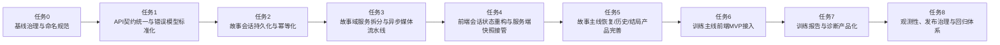

# BlazePen 前后端架构分析与开发规划

- 文档版本: `v1.1`
- 更新日期: `2026-03-20`
- 仓库基线: `0e7eda8 feat: split story query services and recovery UI`
- 适用范围: `frontend/`、`backend/`
- 文档目的: 基于当前代码事实，输出一份可执行、可评审、可分任务推进的前后端开发规划文档。

---

## 1. 文档结论

当前项目不是一条单一演进路径，而是两条成熟度不同的业务线并存:

1. 故事游戏主线已经完成前端用户路径与后端基础能力，具备可运行产品雏形。
2. 训练引擎主线在后端工程化程度更高，但尚未真正进入前端产品主流程。
3. 故事主线当前最大问题不是功能缺失，而是会话状态、接口契约、领域边界和媒体资源流程尚未稳定。
4. 后续开发不应继续直接扩功能面，而应先完成契约统一、故事会话持久化、前后端状态职责收敛，再推进训练前端化与生产级治理。

一句话判断:

> 这是一个“前端已产品化的故事游戏壳 + 后端已工程化的训练引擎核”的组合项目。最佳实践不是继续让两条线各自生长，而是先把故事主线补齐到训练主线的工程质量，再把训练主线产品化接入前端。

### 1.1 当前推进快照（2026-03-20）

#### 后端

1. `PR-BE-01 ~ PR-BE-03` 已完成基础治理、契约统一与 story 会话持久化基线。
2. `PR-BE-04` 主体已落地：`GameService` 已不再同时承担会话、回合、结局和媒体合同；`StorySessionService`、`StoryTurnService`、`StoryEndingService`、`StoryHistoryService` 已形成主边界。
3. 之前“结局判断依赖运行时会话”的风险已明显收敛，结局查询已经基于持久化事实输出，不应再把进程内会话视为权威状态。
4. `PR-BE-05` 已进入收尾阶段：session list、history、ending 查询接口已存在；当前工作区正在补 recent sessions 的 latest snapshot 批量读取，准备关闭查询侧 N+1。

#### 前端

1. `PR-FE-03` 主体已落地：story 运行时已拆出 `useStoryEnding`、`useStorySessionTranscript`、`useGameInit`、`useStorySessionRestore`、`useStoryTurnSubmission` 等职责单元，角色选择链路也已继续细分。
2. `PR-FE-04` 部分落地：服务端快照恢复、active-session 与 resume-save 分层、本地只读兜底已进入代码事实。
3. `PR-FE-05` 部分落地：transcript dialog 和 ending dialog 已有产品形态，但查询契约和恢复模型尚未完全收口。
4. 前端当前仍不能宣布“故事会话恢复链路已完成解耦”，因为恢复与结局消费仍保留 legacy 和客户端 fallback 双轨。

#### 当前必须强调的问题

1. `frontend/src/services/gameApi.ts:270` 仍调用 legacy `/v1/game/check-ending/{threadId}`。这会让 `PR-FE-05` 的结局产品层继续依赖兼容接口，而不是消费 `PR-BE-05` 已提供的 canonical ending summary。
2. `frontend/src/hooks/useStoryTurnSubmission.ts:117` 仍在 hook 内编排 `initGame -> initializeStory` 恢复流程。这说明 `PR-FE-04` 还没有把恢复模型收口成“前端只消费结构化恢复结果”的形态，`hooks` 仍然握有一部分服务端应该裁决的恢复策略。
3. `/api/v1/game/sessions?user_id=` 的 ownership/policy 仍未明确。只要这一点不清晰，`PR-BE-05` 的 query route 就还不是可长期承诺的稳定外部契约。
4. transcript 弹窗当前展示的是“当前设备已加载消息”，不等同于服务端完整 history。只要前端还没有接入 canonical history route，就不能把该能力表述成“历史回放已完成”。

---

## 2. 当前架构基线

## 2.1 总体结构

仓库当前由以下核心目录构成:

- `frontend/`: React 19 + Vite + TypeScript 前端工程。
- `backend/`: FastAPI + SQLAlchemy 后端工程。
- `docs/`: 历史设计文档与阶段性报告。

当前代码事实显示，运行时主线分为两套:

- 故事游戏运行时: 以 `backend/api/services/game_service.py`、`backend/api/services/game_session.py`、`backend/game/story_engine.py` 为主。
- 训练运行时: 以 `backend/api/services/training_service.py` 与 `backend/training/*` policy/store 体系为主。

---

## 2.2 前端现状分析

### 2.2.1 现有结构

前端主链路已经形成固定页面路径:

- `Home`
- `FirstStep`
- `CharacterSetting`
- `CharacterSelection`
- `FirstMeetingSelection`
- `Game`

核心入口与状态组织如下:

- 路由入口: `frontend/src/router/index.tsx`
- 全局流程状态: `frontend/src/contexts/gameFlowCore.ts`
- 场景选择流程: `frontend/src/flows/useFirstMeetingFlow.ts`
- 游戏运行时流程: `frontend/src/flows/useGameSessionFlow.ts`
- 游戏初始化与恢复: `frontend/src/hooks/useGameInit.ts`
- 游戏页面本地运行态: `frontend/src/hooks/useGameState.ts`
- 故事接口适配: `frontend/src/services/characterApi.ts`、`frontend/src/services/gameApi.ts`

### 2.2.2 当前优点

1. 页面路径清晰，用户完成角色创建、初遇场景选择、进入游戏的主流程已经跑通。
2. 前端已经具备较好的分层意识，页面、flow、hook、service、storage 有基本拆分。
3. API 响应已经通过 `normalize` 逻辑进行一定程度的格式转换，说明前端具备 DTO 适配层意识。
4. 本地存储已经被用于恢复草稿和恢复游戏，对用户体验有基础兜底作用。
5. 游戏页面对场景图、合成图、角色图都做了加载失败降级处理，运行体验有一定韧性。

### 2.2.3 当前问题

1. 前端状态所有权不清晰。
   当前同时存在:
   - 页面运行时状态
   - `GameFlowContext` 全局流程状态
   - localStorage 持久化状态
   - 后端会话状态

   这些状态并未形成严格主从关系，容易导致恢复逻辑复杂化。

2. 前端对故事主线已有产品化封装，但对训练主线尚无产品化接入。
   当前前端代码中没有训练页面、训练路由和训练主流程入口。

3. 游戏初始化逻辑过于集中。
   `useGameInit.ts` 同时承担:
   - 会话恢复
   - 本地快照读取
   - 初始化故事
   - 素材恢复
   - 初始消息构建

   这会使后续扩展历史回放、重连恢复、多模式切换时复杂度快速上升。

4. 页面层仍然承担了部分服务端异常语义识别。
   例如基于错误消息文本判断“会话丢失/恢复失败/超时”，这不是稳定契约。

5. 训练与故事尚未形成统一的产品外壳。
   当前前端是“故事 UI 工程”，还不是“多模式会话产品”。

### 2.2.4 前端现阶段结论

前端适合继续沿用当前的页面组织方式，但必须完成一次“状态职责收敛”。后续不应继续在现有 `Game` 页流程上无约束叠加模式分支，否则会演变为难以评审和难以恢复的流程脚本。

---

## 2.3 后端现状分析

### 2.3.1 现有结构

后端当前统一由 FastAPI 应用对外暴露接口:

- 应用入口: `backend/api/app.py`
- 路由层:
  - `backend/api/routers/characters.py`
  - `backend/api/routers/game.py`
  - `backend/api/routers/training.py`
  - `backend/api/routers/tts.py`
  - `backend/api/routers/vector_db_admin.py`
- 依赖注入入口: `backend/api/dependencies.py`

主要存在两条业务域:

1. 故事游戏域
   - `backend/api/services/game_service.py`
   - `backend/api/services/game_session.py`
   - `backend/game/story_engine.py`

2. 训练引擎域
   - `backend/api/services/training_service.py`
   - `backend/training/*`
   - `backend/models/training.py`

### 2.3.2 当前优点

1. 路由已经按大类拆分，API 入口结构不混乱。
2. 依赖注入采用懒加载，避免无关服务在启动时被全部提前初始化。
3. 训练引擎的服务层明显比故事主线更成熟，已经具备:
   - store 层
   - policy 层
   - output assembler
   - runtime state
   - telemetry / reporting 结构
4. 角色、TTS、故事、训练这些能力已经初步成型，说明业务能力不是问题，工程边界才是问题。

### 2.3.3 当前问题

1. 故事会话仍是进程内内存单例。
   `GameSessionManager` 使用 `_sessions: Dict[str, GameSession]` 持有会话。
   这意味着:
   - 服务重启即丢失
   - 多实例无法共享
   - 无法形成可靠恢复
   - 难以支持真正的幂等提交

2. `GameService` 职责过重。
   当前同时负责:
   - 会话创建
   - 故事初始化
   - 剧情推进
   - 场景图与合成图查找
   - 结局判断
   - 大量 URL 验证与 fallback

   这不是稳定的领域服务，而是巨型过程编排器。

3. 领域边界发生穿透。
   故事初始化接口被挂在 `characters` 路由下，说明“角色域”和“故事域”没有完成职责隔离。

4. 故事主线与训练主线的工程质量严重不对称。
   训练主线已经接近可持续迭代结构，故事主线仍然保留较多历史式实现。

5. 媒体资源流程仍处于热路径耦合状态。
   场景图、合成图、角色图 URL 的查找与验证仍深嵌在故事推进服务中，后续会影响性能与可维护性。

### 2.3.4 后端现阶段结论

后端不应继续横向增加故事功能，而应优先做“故事运行时升级”。目标不是重写，而是让故事主线逐步具备训练主线已有的工程属性: 明确 DTO、持久化会话、幂等回合提交、分层服务、可观测性。

---

## 2.4 当前关键结构性风险

以下问题在后续开发中应视为高优先级结构性风险:

1. 前端 localStorage 与后端内存会话同时承担恢复职责，状态来源不唯一。
2. 故事提交依赖内存会话，导致恢复、重放、并发、重启容错能力弱。
3. 路由层与服务层的领域边界尚未稳定，后续扩展很容易再度穿透。
4. 训练能力未接入前端，产品层面存在两套不对齐的能力体系。
5. 媒体资源生成与业务热路径耦合，后续上线时将成为不稳定点。

---

## 3. 开发原则

后续所有任务包应统一遵循以下原则:

1. 契约优先。
   任何接口变更先定义请求、响应、错误模型，再进入实现。

2. 会话单一事实源。
   游戏或训练会话的权威状态必须由服务端持久化存储承载，前端缓存只能是 UX 优化层，不得成为事实源。

3. 领域边界清晰。
   角色域只负责角色，故事域只负责故事，训练域只负责训练，媒体域只负责资源。

4. 页面不兼容脏契约。
   页面与 flow 不直接判断后端原始字段混乱形式，所有兼容逻辑必须下沉到 service/normalizer。

5. 热路径最短化。
   图片、音频、报告生成等重任务优先异步化，不占用用户交互主路径。

6. 一次任务包只解决一类问题。
   不允许在一个提交中同时做大规模接口调整、状态重构、视觉改版和新业务功能。

7. 每个任务包都必须能独立 review。
   这也是后续前后端分开 review 的前提。

---

## 4. 总体开发规划图

### 4.1 任务包顺序说明

| 任务包 | 核心目标 | 是否必须先完成 |
| --- | --- | --- |
| 任务0 | 冻结术语、边界、评审口径 | 是 |
| 任务1 | 统一接口契约与错误模型 | 是 |
| 任务2 | 让故事会话可恢复、可幂等 | 是 |
| 任务3 | 清理故事后端巨型服务 | 是 |
| 任务4 | 让前端状态职责收敛 | 是 |
| 任务5 | 完成故事主线产品稳定化 | 建议 |
| 任务6 | 训练前端 MVP 接入 | 依赖任务1，建议在任务4后开始 |
| 任务7 | 完成训练报告和诊断产品化 | 依赖任务6 |
| 任务8 | 形成可发布和可回归体系 | 必须最终完成 |

### 4.2 并行原则

1. `任务0 ~ 任务2` 以串行为主，不建议并行。
2. `任务3` 与 `任务4` 可在边界明确后小范围并行，但必须共享同一份契约文档。
3. `任务6` 可在故事主线状态重构稳定后启动，不应提前抢跑。
4. `任务8` 中的观测与测试基础设施可以提前铺设，但正式验收要等主链路稳定后统一完成。

---

## 5. 分任务开发规划

> 说明: 以下“任务包”即建议的提交粒度和后续 review 粒度。每个任务包都必须能独立评审、独立回滚、独立验收。

## 5.1 任务0：基线治理与命名规范

### 目标

建立统一术语、统一领域边界、统一 review 口径，避免后续开发过程出现同义不同名和职责穿透。

### 前端任务

1. 明确并文档化前端状态分类:
   - 角色草稿状态
   - 服务端会话镜像状态
   - 页面纯 UI 状态
2. 梳理现有 `flow / hook / service / storage` 的职责说明。
3. 明确故事模式与训练模式在路由层的拆分策略。

### 后端任务

1. 明确五个域的边界:
   - character
   - story
   - training
   - media
   - admin
2. 统一命名词表:
   - `characterId`
   - `threadId`
   - `sessionId`
   - `sceneId`
   - `roundNo`
   - `runtimeState`
3. 明确哪些历史接口保留兼容，哪些接口进入废弃清单。

### 接口/契约要求

1. 定义统一响应 envelope。
2. 定义统一错误结构:
   - `code`
   - `message`
   - `details`
   - `traceId`
3. 明确故事与训练会话类型不混用:
   - 故事使用 `threadId`
   - 训练使用 `sessionId`

### 测试与验收

1. 形成一份正式接口清单。
2. 形成一份正式术语表。
3. 形成一份状态流转图。

### 交付物

1. 架构基线文档
2. 接口契约表
3. 术语表
4. review 检查项基线

---

## 5.2 任务1：API 契约统一与错误模型标准化

### 目标

让前后端交互建立在稳定 DTO 上，而不是页面通过字段猜测和错误文本推断业务语义。

### 前端任务

1. 所有故事与训练接口统一经过 service 层封装。
2. 所有 snake_case 到 camelCase 转换统一收敛到 normalizer。
3. 页面与 flow 不再直接解析后端原始 envelope。
4. 错误处理统一改为基于错误码或标准字段，而不是字符串包含判断。

### 后端任务

1. 统一故事初始化、故事回合提交、训练初始化、训练回合提交的响应 DTO。
2. 统一错误码体系，例如:
   - `STORY_SESSION_NOT_FOUND`
   - `STORY_SESSION_EXPIRED`
   - `STORY_OPTION_RESELECT_REQUIRED`
   - `TRAINING_SESSION_NOT_FOUND`
   - `VALIDATION_ERROR`
3. 对现有路由返回值做统一封装，消除同类接口不同结构。

### 接口/契约要求

1. 故事主线定义:
   - 初始化响应 DTO
   - 回合响应 DTO
   - 会话恢复响应 DTO
2. 训练主线定义:
   - 初始化响应 DTO
   - 下一场景 DTO
   - 回合提交 DTO
   - 进度 DTO
   - 报告 DTO
3. 所有响应显式标注 `status` 或 `sessionState`。

### 测试与验收

1. 前端不再依赖错误消息文本识别业务状态。
2. 接口文档与实际响应一致。
3. 后端单测覆盖标准错误码分支。

### 交付物

1. 统一 API DTO 文档
2. 统一错误码表
3. 前端 normalizer 清单

---

## 5.3 任务2：故事会话持久化与幂等化

### 目标

把故事会话从进程内内存迁移到可恢复、可审计、可幂等的持久化模型。

### 前端任务

1. 调整游戏恢复逻辑，区分:
   - 服务端会话可恢复
   - 会话已过期但可重新初始化
   - 会话已失效且不可恢复
2. 本地存储从“事实源”降级为“体验缓存”。
3. 游戏页刷新时优先请求服务端会话快照，而不是仅依赖本地快照。

### 后端任务

1. 新增故事会话持久化模型，至少包括:
   - `story_session`
   - `story_round`
   - `story_snapshot`
2. 替换 `GameSessionManager._sessions` 为持久化存储访问层。
3. 故事回合提交增加幂等键或回合号约束，防止重复提交。
4. 实现显式会话恢复接口或稳定恢复语义。
5. 会话重启后可根据快照恢复到最近稳定状态。

### 接口/契约要求

1. 新增故事会话快照读取接口。
2. 新增故事会话恢复接口或明确恢复响应。
3. 回合提交响应必须包含:
   - 当前回合号
   - 当前会话状态
   - 是否需要重新选择
   - 最新快照摘要

### 测试与验收

1. 后端重启后，进行中的故事会话能够恢复。
2. 同一选项重复提交不会造成双写或回合错位。
3. 前端刷新游戏页后可以从服务端恢复到最近状态。

### 交付物

1. 故事会话表结构
2. 故事快照恢复接口
3. 幂等提交机制

---

## 5.4 任务3：故事域服务拆分与异步媒体流水线

### 目标

把故事后端从“巨型流程服务”拆为稳定的领域服务和媒体服务，减少热路径耦合。

### 当前进度（2026-03-20）

1. 后端主体已落地，`GameService` 职责已明显收缩，story session/turn/ending/history 服务已拆出。
2. 结局权威事实已回到持久化层，这是当前后端架构质量最关键的正向变化之一。
3. 本任务仍需持续守住边界：后续 query/read-model 增补不得把 story 读取职责重新倒灌回 `GameService` 或其他聚合 service。

### 前端任务

1. API 调用模块按领域拆分为:
   - `characterApi`
   - `storyApi`
   - `trainingApi`
   - `mediaApi`
2. 页面和 flow 层不再直接调用跨域接口。
3. 图片和音频资源的呈现改为显式资源状态消费，而不是隐式猜测 URL 有无。

### 后端任务

1. 从 `GameService` 中拆分:
   - `StorySessionService`
   - `StoryTurnService`
   - `StoryEndingService`
   - `StoryAssetService`
2. 故事初始化接口迁移到 story/game 域，不再挂在 character 域。
3. 场景图、合成图、角色图、TTS 资源改为异步任务或后台流水线。
4. 故事接口返回“资源状态”和“资源 URL”，而不是在热路径做过多文件查找和猜测。

### 接口/契约要求

1. 资源状态统一字段，例如:
   - `pending`
   - `ready`
   - `failed`
2. 故事回合响应中资源信息结构化，不允许散落多个隐含 URL 字段。

### 测试与验收

1. `GameService` 不再承担素材查找和大量 URL 验证逻辑。
2. 单个 story service 的职责可以一句话说明。
3. 媒体生成失败不会阻塞故事主线推进。

### 交付物

1. 拆分后的故事服务层
2. 异步媒体任务链路
3. 领域归属明确的新路由结构

---

## 5.5 任务4：前端会话状态重构与服务端快照接管

### 目标

让前端状态从“流程脚本驱动”切换到“服务端快照驱动”，降低恢复复杂度。

### 当前进度（2026-03-20）

1. 前端已开始按“初始化 / 恢复 / transcript / ending / submit”拆分 hook，服务端快照恢复也已进入主路径。
2. 但恢复策略仍有一部分停留在 `useStoryTurnSubmission` 内部，这说明快照接管尚未真正成为单一事实源。
3. 因此本任务当前只能判定为“主体已落地，收口未完成”；只要 hook 还在自编排重建会话，就不能视为彻底完成。

### 前端任务

1. 将当前游戏状态拆成三层:
   - 服务端会话快照层
   - 页面展示状态层
   - 本地草稿与缓存层
2. 重构 `useGameInit.ts`，拆开:
   - 首次初始化
   - 断点恢复
   - 本地缓存读取
   - 资源恢复
3. `GameFlowContext` 仅保留入口流程和角色草稿，不再承载过多运行时数据。
4. 游戏页以服务端快照为主输入，减少本地拼装逻辑。

### 后端任务

1. 提供稳定的故事会话读取接口。
2. 提供故事历史回合读取接口。
3. 提供快照版本号或更新时间字段，支持前端判断是否需要重新拉取。

### 接口/契约要求

1. 定义统一会话快照 DTO。
2. 定义统一回合历史 DTO。
3. 明确页面恢复时哪些字段由服务端提供，哪些字段允许前端本地兜底。

### 测试与验收

1. 游戏页刷新后不依赖 localStorage 也能恢复基本状态。
2. localStorage 缓存损坏时，页面仍可从服务端恢复。
3. 初始化、恢复、重连三类路径逻辑分开可测。

### 交付物

1. 重构后的游戏状态模型
2. 服务端快照驱动恢复流程
3. 明确的状态层次说明

---

## 5.6 任务5：故事主线恢复、历史与结局产品完善

### 目标

在架构稳定后补齐故事主线产品层能力，使其具备完整用户体验闭环。

### 当前进度（2026-03-20）

1. 后端已提供 recent sessions、history、ending 查询能力，前端也已有 transcript 和 ending 的产品容器。
2. 当前主要缺口不在 UI，而在契约切换：前端 ending 仍走 legacy route，history 仍未真正消费服务端 read model。
3. 因此本任务不能因为“弹窗已出现”就判定完成，必须以 canonical history/ending 契约接入和异常路径回归为完成标准。

### 前端任务

1. 增加故事会话恢复入口。
2. 增加故事历史查看或最近回合回放能力。
3. 明确结局页或结局结果呈现页。
4. 增加会话过期、恢复成功、需要重选、媒体失败等显式提示状态。

### 后端任务

1. 提供故事历史查询接口。
2. 提供结局结果查询接口或结局摘要结构。
3. 对结局判断逻辑和回放逻辑进行结构化输出。

### 接口/契约要求

1. 结局 DTO 统一:
   - 结局类型
   - 结局说明
   - 关键状态值
2. 历史 DTO 统一:
   - 回合号
   - 角色发言
   - 用户选择
   - 状态变化摘要

### 测试与验收

1. 用户可以从最近会话列表恢复故事。
2. 用户可以看到结局结果而非仅停在最后一轮对话。
3. 历史回放不影响主会话状态。

### 交付物

1. 故事历史能力
2. 故事结局结果页
3. 更完整的异常与恢复 UX

---

## 5.7 任务6：训练主线前端 MVP 接入

### 目标

把训练主线从“只有后端能力”升级为“前端可用产品流程”。

### 前端任务

1. 新增训练入口与训练模式选择页。
2. 新增训练场景页面与回合提交页面。
3. 接入训练初始化、下一场景、回合提交接口。
4. 训练页与故事页复用基础组件，但业务 hook 必须分离。

### 后端任务

1. 保持训练 API DTO 稳定，补齐前端接入缺失字段。
2. 如果需要，新增训练会话摘要接口，供前端入口页展示。
3. 校正训练 API 文档与真实返回的一致性。

### 接口/契约要求

1. 训练前端只使用 `sessionId`，不混用 `threadId`。
2. 训练回合响应必须显式包含:
   - 当前回合号
   - 是否完成
   - `nextScenario`
   - `evaluation`
   - `runtimeState`

### 测试与验收

1. 前端完整跑通:
   - `init`
   - `next scenario`
   - `submit round`
2. 训练与故事两条线互不污染状态。
3. 训练页面刷新后能恢复到当前回合。

### 交付物

1. 训练入口页
2. 训练流程页
3. 训练前端 API 适配层

---

## 5.8 任务7：训练报告与诊断产品化

### 目标

补齐训练模式的结果页、报告页和诊断页，使训练主线具备完整闭环。

### 前端任务

1. 新增训练进度页。
2. 新增训练报告页。
3. 新增训练诊断页或诊断抽屉面板。
4. 明确风险标记、能力评分、推荐分支的可视化方式。

### 后端任务

1. 提供稳定的训练进度摘要、训练报告、训练诊断接口。
2. 明确报告聚合结构，避免前端自行拼接。
3. 对 recommendation、diagnostics、audit 数据做面向产品的 DTO 裁剪。

### 接口/契约要求

1. 报告 DTO 和诊断 DTO 不直接暴露过于底层的内部结构。
2. 前端需要的是“展示结构”，后端不应把未经整理的原始 payload 直接抛出。

### 测试与验收

1. 报告页可直接展示，不依赖前端二次拼装复杂逻辑。
2. 诊断页字段含义清晰，具备可解释性。
3. 一次训练会话完成后可以完整查看:
   - 过程
   - 结果
   - 建议
   - 诊断

### 交付物

1. 训练进度页
2. 训练报告页
3. 训练诊断页

---

## 5.9 任务8：观测性、发布治理与回归体系

### 目标

将项目从“可开发”提升为“可发布、可回归、可定位问题”。

### 前端任务

1. 增加关键路径埋点:
   - 角色创建
   - 故事初始化
   - 故事回合提交
   - 训练初始化
   - 训练回合提交
2. 增加错误边界和关键页面兜底。
3. 建立前端 E2E 冒烟脚本，覆盖故事主线与训练主线。

### 后端任务

1. 接入结构化日志与 `traceId`。
2. 关键接口记录:
   - 请求耗时
   - 错误码
   - 资源生成状态
3. 明确数据库迁移规范，不允许启动时隐式改库。
4. 为故事与训练主线建立基础集成测试。

### 接口/契约要求

1. 所有错误响应包含可关联的 `traceId`。
2. 所有关键异步任务可追踪状态。
3. 发布说明必须包含:
   - 接口变更
   - 数据变更
   - 配置变更
   - 回滚说明

### 测试与验收

1. 故事主线和训练主线均有 E2E 冒烟测试。
2. 后端关键接口有集成测试。
3. 发生异常时能通过日志或 trace 快速定位到接口、会话和资源任务。

### 交付物

1. 观测性方案
2. 回归测试基线
3. 发布与回滚清单

---

## 6. 推荐 PR 切分方式

后续建议继续按 FE / BE 双轨执行，并在状态判断上明确“已完成主体”和“真正收口完成”的区别。

### 6.1 后端执行线（当前状态）

1. `PR-BE-01`: 已完成，后续只作为术语和边界的 review 守线。
2. `PR-BE-02`: 已完成，DTO、错误模型、响应 envelope 和 trace 基线已建立；后续新增 route 不得回退到 message 驱动语义。
3. `PR-BE-03`: 已完成，story session/snapshot/idempotency 已成为后续恢复链路基础。
4. `PR-BE-04`: 主体已完成，`GameService` 拆分已经进入稳定期；后续 story query/read-model 能力继续落在 `story/*service` 与 `repository-store` 边界，不回灌巨型 service。
5. `PR-BE-05`: 进行中，session/history/ending route 已落地；当前重点是 ownership/policy、recent sessions batch snapshot read、前端消费语义收口。
6. `PR-BE-06 ~ PR-BE-07`: 暂不建议提前启动，先完成 story 主线 query/recovery closure。

### 6.2 前端执行线（当前状态）

1. `PR-FE-01`: 已完成，后续只守 `pages / flows / hooks / services / storage / contexts` 边界。
2. `PR-FE-02`: 已完成主体，但 story read model 仍有 legacy contract 残留，新增页面不得继续在页面层兼容脏字段。
3. `PR-FE-03`: 主体已落地，但不能视为完全收口；只要 `useStoryTurnSubmission` 仍自编排恢复，本 PR 就仍有尾项。
4. `PR-FE-04`: 进行中；服务端快照已进入恢复链路，但仍需把 expired/not-found 等恢复决策下沉为统一契约。
5. `PR-FE-05`: 进行中；产品 UI 已有，但必须完成 canonical ending/history 接入，才能宣告 story 恢复与结局产品化完成。
6. `PR-FE-06 ~ PR-FE-08`: 暂不建议在 story 会话、恢复、ending 未收口前扩大范围。

### 6.3 当前不应误判为“已完成”的事项

1. `PR-FE-03` 不能因为 hook 已拆分就判定完成，前提是恢复策略必须退出页面和 hook 的自编排。
2. `PR-FE-04` 不能因为已经能从 snapshot 或 localStorage 恢复就判定完成，前提是服务端快照成为单一事实源。
3. `PR-FE-05` 不能因为已经有 transcript/ending dialog 就判定完成，前提是页面切到 canonical ending/history 契约。
4. `PR-BE-05` 不能因为查询 route 已开放就判定完成，前提是 ownership/policy、批量查询性能和前端消费语义都已收口。

不建议的提交方式:

1. 在一个 PR 中同时修改故事接口契约、训练页面、游戏状态模型和视觉样式。
2. 在没有完成任务1 和任务2 的前提下继续横向扩故事功能。
3. 在页面层直接兼容多个历史接口返回格式。

---

## 7. 后续 review 维度

为便于后续“前后端分开 review”，建议统一采用下列检查框架。

### 7.1 前端 review 重点

1. 状态所有权是否清晰。
2. 页面是否直接兼容后端脏字段。
3. flow/hook 是否承担了不属于自己的职责。
4. 是否把服务端会话当成事实源，而非继续依赖 localStorage。
5. 错误处理是否基于稳定错误码，而不是消息文本。
6. 是否出现故事与训练业务逻辑混用。
7. 是否破坏恢复、刷新、回退等关键路径。

### 7.2 后端 review 重点

1. 是否继续扩大巨型 service 的职责。
2. 会话、回合、快照是否具备明确边界。
3. 提交是否具备幂等性与可恢复性。
4. 路由是否跨领域承载业务。
5. DTO 是否稳定、字段命名是否统一。
6. 是否把重任务继续塞进同步热路径。
7. 是否具备足够日志、错误码和可追踪性。

---

## 8. 当前阶段的明确建议

在 `2026-03-20` 这个基线下，最合理的下一步不是“继续扩故事功能”，而是“把 `PR-BE-05 / PR-FE-04 / PR-FE-05` 收口到同一套契约和恢复模型”。

1. 后端优先收尾 `PR-BE-05`：
   - 明确 `/api/v1/game/sessions?user_id=` 的 ownership/policy。
   - 完成 recent sessions latest snapshot 批量读取和对应测试，关闭 query-side N+1。
   - 固化 history/ending read model，避免后续前端迁移时再次改字段语义。
2. 前端优先收尾 `PR-FE-04 / PR-FE-05`：
   - 把 ending summary 从 legacy `/v1/game/check-ending/{threadId}` 迁移到 canonical `/v1/game/sessions/{thread_id}/ending`。
   - 让恢复链路只消费结构化恢复结果，不再在 hook 中自编排 `initGame -> initializeStory`。
   - 明确 transcript 与 server history 的产品语义，避免把“本地已加载消息”误表述成“完整历史”。
3. `PR-FE-03` 只在上述两点完成后才可宣告收口；否则当前“hook 已拆分”的状态仍只是结构改善，不是恢复模型完成。
4. 在 story 主线恢复、历史、结局的契约未稳定前，不建议扩大 `PR-FE-06 / PR-BE-06` 的训练前端接入范围。
5. 每次配对 PR 合并前，必须继续按前端和后端分开 review，并把结论回写到 `docs/reviews/`，防止状态判断再次漂移。

当前最不建议做的事情:

1. 继续直接往故事主线叠加新玩法或新页面。
2. 在前端继续增加更多基于 localStorage 的恢复分支。
3. 让角色域继续承载故事初始化等跨域职责。
4. 在训练前端未落地前，假设项目已经是统一产品。

---

## 9. 参考代码锚点

以下文件是本规划判断的主要代码依据:

### 前端

- `frontend/src/router/index.tsx`
- `frontend/src/contexts/gameFlowCore.ts`
- `frontend/src/flows/useFirstMeetingFlow.ts`
- `frontend/src/flows/useGameSessionFlow.ts`
- `frontend/src/hooks/useGameInit.ts`
- `frontend/src/hooks/useStorySessionRestore.ts`
- `frontend/src/hooks/useStoryTurnSubmission.ts`
- `frontend/src/hooks/useStoryEnding.ts`
- `frontend/src/hooks/useStorySessionTranscript.ts`
- `frontend/src/hooks/useGameState.ts`
- `frontend/src/services/characterApi.ts`
- `frontend/src/services/gameApi.ts`
- `frontend/src/pages/Game.tsx`

### 后端

- `backend/api/app.py`
- `backend/api/dependencies.py`
- `backend/api/routers/characters.py`
- `backend/api/routers/game.py`
- `backend/api/routers/training.py`
- `backend/api/services/game_session.py`
- `backend/api/services/game_service.py`
- `backend/story/story_session_service.py`
- `backend/story/story_turn_service.py`
- `backend/story/story_ending_service.py`
- `backend/story/story_history_service.py`
- `backend/api/services/training_service.py`
- `backend/game/story_engine.py`

---

## 10. 最终判断

这个项目当前最重要的不是“继续写更多功能”，而是“先把故事主线补齐到训练主线已经具备的工程标准”。只要完成契约统一、故事会话持久化、前端状态职责收敛，后续无论是继续做故事玩法，还是把训练主线前端化，都会进入一个可以稳定 review、稳定回归、稳定发布的阶段。

如果后续开发严格按本任务包推进，那么前后端 review 将可以稳定采用同一模式:

- 前端 review 聚焦状态、页面职责、契约消费与恢复路径。
- 后端 review 聚焦领域边界、会话一致性、DTO、幂等与观测性。

这也是当前仓库从“可运行原型”走向“可持续开发产品”的合理路径。
